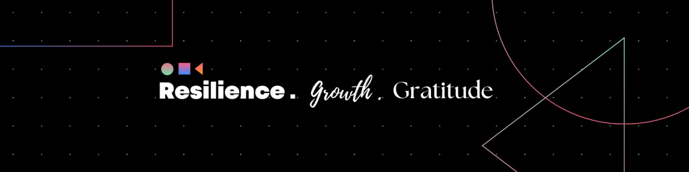

<!--- Body Begins -->

<h1 align="center"> Hi there, I'm <a href="https://www.linkedin.com/in/shubhanshu-kaintura-499876283/">Shubhanshu</a> </h1>

<!--- Adding Header Elements -->

  <a href="https://www.linkedin.com/in/shubhanshu-kaintura-499876283/">LinkedIn</a> - 
  <a href="https://leetcode.com/u/shubhanshukaintura/">Leetcode</a> -
  <a href="https://www.geeksforgeeks.org/user/shubhanshu_kaintura/">GeeksForGeeks</a> -
  <a href="mailto:shubhanshukaintura2@gmail.com">Contact me</a>

-----------------------------------------------------------
👨🏻‍💻 **About Me** 
[<spline-viewer url="https://prod.spline.design/uA7lADRrJdmuFPcM/scene.splinecode"></spline-viewer>](https://my.spline.design/robottutorialinteractiveeventscopy-2199e36ce1b9774aa6275acd9db2091a/)
✨ Full Stack Web Developer | UI/UX Designer  
⚡ My Recent Web Project ✨ [Website](https://mahaavirkantura.com/) 
📫 How to reach me: [Mail](mailto:shubhanshukaintura2@gmail.com) or visit [LinkedIn](https://www.linkedin.com/in/shubhanshu-kaintura-499876283/) 
💬 Ask me about Web Designing & Development  

<!--- Adding Tech Stack open Section -->
<b>🛠Tech Stack</b> 
Languages: &nbsp;
&nbsp;
&nbsp;
&nbsp; 
&nbsp;
 &nbsp; 
Frameworks and Libraries: <!--- Frameworks and Libraries goes here -->
&nbsp;
&nbsp;
&nbsp;
&nbsp;
&nbsp;&nbsp; 
Tools and Platforms: &nbsp; 
&nbsp;
&nbsp;
&nbsp;&nbsp; 
Operating Systems: &nbsp;
&nbsp;
&nbsp;  

<!--- 2nd Section on GitHub Analytics -->

<b>⚙️GitHub Analytics</b> 
 

 

 
     

<!--- 3rd Section on Recent Projects -->
<b>📚Recent Project/Activity</b> 
✨ [Web Projects - React, Javscript](https://github.com/shubhanshukaintura/my-web-projects) 

<!--- Footer Starts - Adding the Social Media Status count-->

 
  &nbsp;&nbsp;</a>

#### Show some ❤️ by starring some of the repositories!

<!--- Footer End -->
<!--- Body End -->

